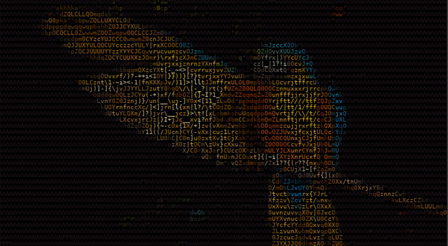
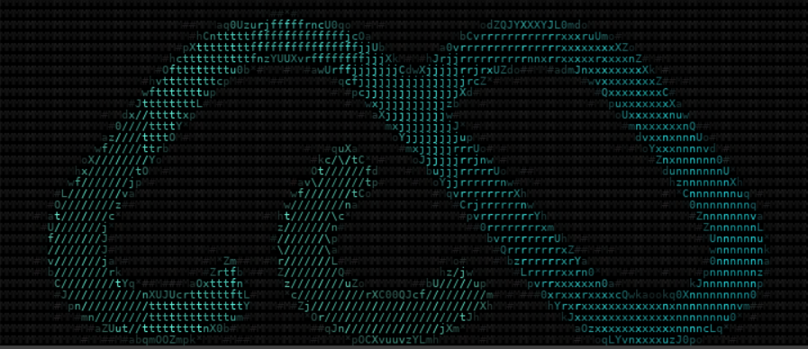
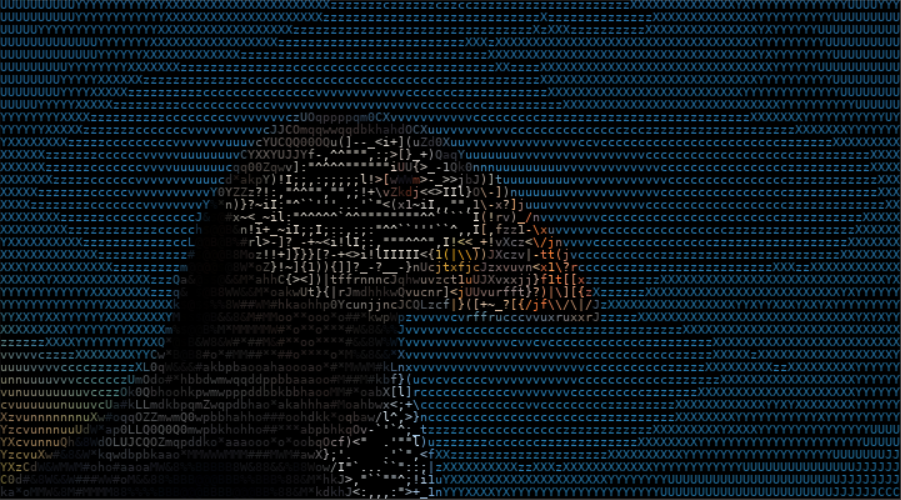

# ASCII ART GENERATOR
The project aims at generating both black & white and colored Ascii Arts from images and videos. It is implemented using python. Numpy, OpenCV and Pillow libraries are used.
## INDEX
  * [Introduction](#introduction)
  * [Run Project Locally](#localSetup)
  * [Output Screenshots](#screenshots)
  * [Dependencies](#depend)
  * [References](#references)

## <a name="introduction"></a>INTRODUCTION
Python Programs for:
1. Converting Images to ASCII art based on intensity values.
2. Converting Videos to ASCII art by dividing it into picture frames and then recompiling it back to video.

There are two output formats for each type:
1. Black and White
2. Coloured <br>
<a href = "https://drive.google.com/file/d/1T9hfReE6Yvq7wRyOvfGleK0Djk7vLDPg/view?usp=sharing">Link to Demo Video</a>

## <a name="localSetup"></a>Run project locally 
 * Create a fork and clone the fork to your local system: ``` git clone https://github.com/gursimranWadhwa/ascii-art-generator.git ```
 * Run : ``` cd ascii-art-generator/ ```
 * Install the missing dependencies(If any)
 * Open the codebase and edit the path of input image/video and specify the path for output image/video.
 * Run the code using command ``` python3 file_name.py ```


## <a name="screenshots"></a>OUTPUT SCREENSHOTS







## <a name="depend"></a>DEPENDENCIES
#### "cv2"
#### "numpy"
#### "pillow"

## <a name="references"></a>REFERENCES
* <a href="https://en.wikipedia.org/wiki/ASCII_art#Types_and_styles">Wikipedia</a>
* <a href="https://alekya3.medium.com/how-images-are-stored-in-a-computer-f364d11b4e93">Medium</a>
* <a href="https://www.geeksforgeeks.org/opencv-python-tutorial/">Geeks for Geeks</a>
* <a href="https://www.analyticsvidhya.com/blog/2021/03/grayscale-and-rgb-format-for-storing-images/">Analytics Vidhya</a>
* <a href="https://www.w3schools.com/python/numpy/numpy_intro.asp">w3schools</a>