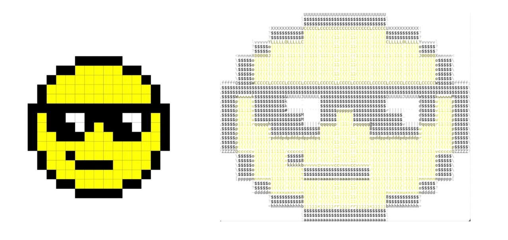

# ASCII ART GENERATOR
The project aims at generating both black & white and colored Ascii Arts from images and videos. It is implemented using python. Numpy, OpenCV and Pillow libraries are used.
## INDEX
  * [Introduction](#introduction)
  * [Run Project Locally](#localSetup)
  * [Output Screenshots](#screenshots)
  * [Basic Functions](#cmnd)
  * [Dependencies](#depend)
  * [Additional Tasks](#tasks)
  * [References](#references)

## <a name="introduction"></a>INTRODUCTION
Python Programs for:
1. Converting Images to ASCII art based on intensity values.
2. Converting Videos to ASCII art by dividing it into picture frames and then recompiling it back to video.

There are two output formats for each type:
1. Black and White
2. Coloured 

<a href = "https://drive.google.com/file/d/1T9hfReE6Yvq7wRyOvfGleK0Djk7vLDPg/view?usp=sharing">Link to Demo Video</a>

## <a name="localSetup"></a>RUNNING THE PROJECT
 * Create a fork and clone the fork to your local system: ``` git clone https://github.com/gursimranWadhwa/ascii-art-generator.git ```
 * Run : ``` cd ascii-art-generator/ ```
 * Install the missing dependencies(If any)
 * Open the codebase and edit the path of input image/video and specify the path for output image/video.
 * Run the code using command ``` python3 file_name.py ```


## <a name="screenshots"></a>OUTPUT SCREENSHOTS



## <a name="cmnd"></a>BASIC FUNCTIONS
* numpy.mean(array, axis): returns mean of the values of array.
* String.join() : Is similar to ‘+’ operator and helps in joining two strings.
* draw.text(xy, text, fill, font): Used to draw string at a given position ‘xy’. We can also set font and color of the text using ‘fill’ and ‘font’ parameters respectively.
* image.getbbox(): Calculates the bounding box of the non-zero region in the
Image or it crops the black borders in the image.
* PIL.ImageDraw allows us to write texts to image. Initializing ImageDraw with
output image.


## <a name="depend"></a>DEPENDENCIES
#### "cv2"
#### "numpy"
#### "pillow"

## <a name="tasks"></a>ADDITIONALS
* Asciified the Videos by extracting frames of input video.
* Both Black & White and Colored Ascii Arts for the videos are produced.

## <a name="references"></a>REFERENCES
* <a href="https://en.wikipedia.org/wiki/ASCII_art#Types_and_styles">Wikipedia</a>
* <a href="https://alekya3.medium.com/how-images-are-stored-in-a-computer-f364d11b4e93">Medium</a>
* <a href="https://www.geeksforgeeks.org/opencv-python-tutorial/">Geeks for Geeks</a>
* <a href="https://www.analyticsvidhya.com/blog/2021/03/grayscale-and-rgb-format-for-storing-images/">Analytics Vidhya</a>
* <a href="https://www.w3schools.com/python/numpy/numpy_intro.asp">w3schools</a>
